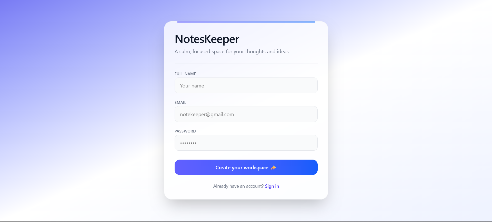
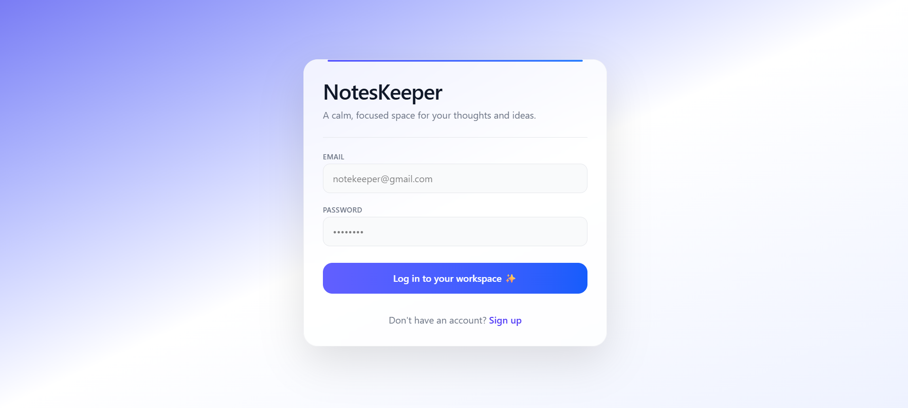
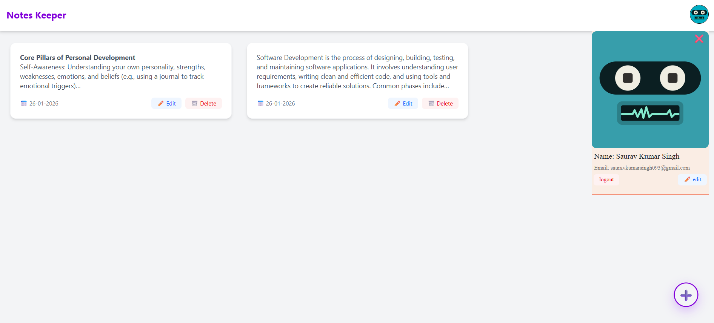
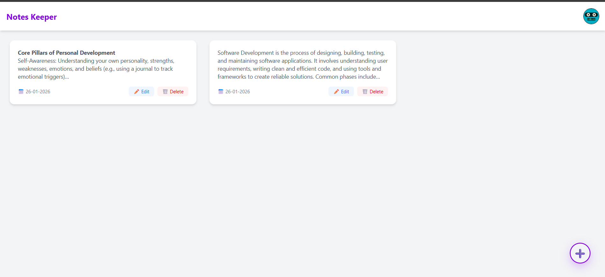

# 📝 Notes Keeper

**Notes Keeper** is a clean, fast, and minimal note-taking application designed to help users capture, manage, and organize their thoughts effortlessly. It focuses on simplicity, performance, and a smooth user experience.

---

## 🚀 Features

- ✍️ Create, edit, and delete notes
- 👀 Preview long notes with smart truncation
- 🗂️ Clean card-based UI for easy readability
- 🕒 Shows note creation date
- 🎨 Modern and responsive design
- ⚡ Fast and lightweight

---

## 🛠️ Tech Stack

- **Frontend:** React.js  
- **Styling:** Tailwind CSS  
- **Icons:** Lucide React  
- **Backend:** Spring Boot
- **Build Tool:** Vite

---

## 📸 Screenshots

  
  

  
  

